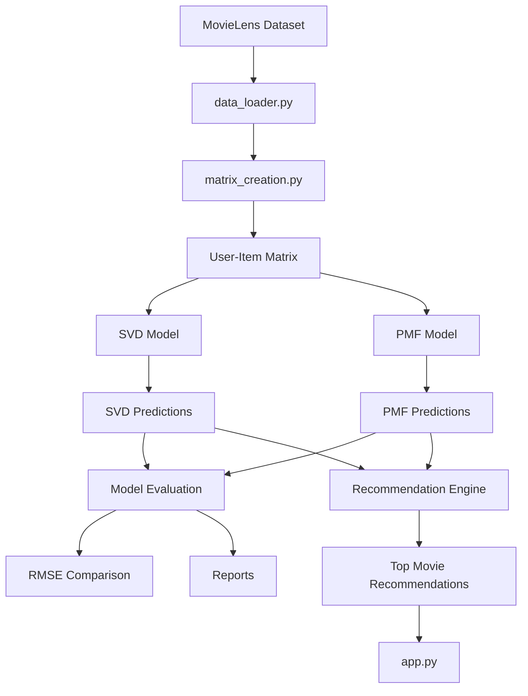
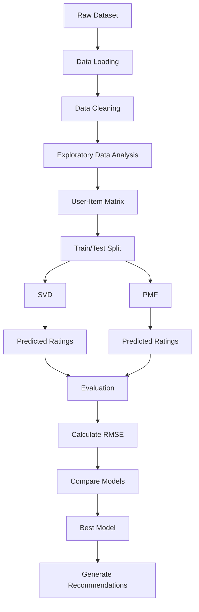

# Matrix Factorization Movie Recommender

## Architecture

### This diagram shows how your files communicate with each other

```mermaid

flowchart TD
    A[MovieLens Dataset]

    A --> B[data_loader.py]
    B --> C[matrix_creation.py]

    C --> D[User-Item Matrix]

    D --> E[SVD Model]
    D --> F[PMF Model]

    E --> G[SVD Predictions]
    F --> H[PMF Predictions]

    G --> I[Model Evaluation]
    H --> I

    I --> J[RMSE Comparison]

    G --> K[Recommendation Engine]
    H --> K

    K --> L[Top Movie Recommendations]

    L --> M[app.py]

    I --> N[Reports]


```

### This diagram focuses on the machine learning pipeline.

```mermaid

flowchart TD
    A[Raw Dataset] --> B[Data Loading]
    B --> C[Data Cleaning]
    C --> D[Exploratory Data Analysis]
    D --> E[User-Item Matrix]

    E --> F[Train/Test Split]

    F --> G[SVD]
    F --> H[PMF]

    G --> I[Predicted Ratings]
    H --> J[Predicted Ratings]

    I --> K[Evaluation]
    J --> K

    K --> L[Calculate RMSE]

    L --> M[Compare Models]
    M --> N[Best Model]

    N --> O[Generate Recommendations]
```